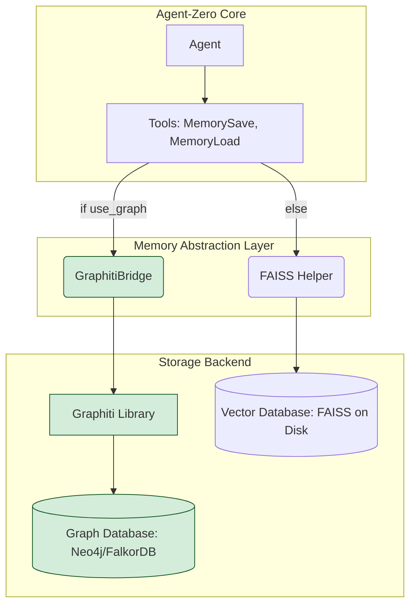

# Agent-Zero 与 Graphiti 集成方案

本文档旨在详细说明如何将 `getzep/graphiti` 知识图谱框架集成到 `agent-zero` 项目中，以增强其记忆和知识管理能力。

## 1. 目的

当前 `agent-zero` 的记忆系统基于 FAISS 向量数据库，适用于非结构化文本的相似性检索 (RAG)。然而，它缺乏对实体间显式关系和时间演变的深刻理解。

通过集成 Graphiti，我们旨在：

*   **引入结构化记忆**：构建一个动态的、相互关联的知识图谱。
*   **增强查询能力**：支持超越向量相似性的复杂查询，如关系追踪和时间点分析。
*   **提升推理能力**：为 Agent 提供一个更丰富的上下文，使其能够进行更深层次的推理。

## 2. 核心设计：`GraphitiBridge`

为了解耦和模块化，我们将创建一个新的帮助模块 `python/helpers/graphiti_bridge.py`。该模块将作为 `agent-zero` 和 `Graphiti` 库之间的“桥梁”。

### `GraphitiBridge` 类的职责

-   **初始化与连接**: 启动时根据配置连接到后端的图数据库（如 Neo4j 或 FalkorDB）。
-   **Schema 定义**: 使用 Pydantic 模型定义知识图谱的核心实体（Nodes）和关系（Edges）。
-   **数据摄入 (`ingest_text`)**: 接收文本，调用 Graphiti 的 LLM 管道提取实体和关系，并将其添加到知识图谱中。
-   **查询接口 (`search`)**: 提供关键词/语义混合搜索、实体关系查询和时间点查询等多种查询方式。

## 3. 现有记忆系统的改造

我们将采用渐进式策略改造现有的 `Memory` 工具，使其能够同时利用 FAISS 和 Graphiti。

-   **`MemorySave`**:
    -   添加 `use_graph: bool = True` 参数。
    -   当 `use_graph` 为 `True` 时，调用 `GraphitiBridge.ingest_text()`。
    -   保留原有的 FAISS 存储流程作为备份。

-   **`MemoryLoad`**:
    -   添加 `search_type: str = "hybrid"` 参数，可接受 `"vector"`, `"graph"`, `"hybrid"`。
    -   根据 `search_type` 调用 `FAISS` 或 `GraphitiBridge` 的搜索方法。

-   **`MemoryForget`**:
    -   改造此工具以适应 Graphiti 的“版本化”数据模型，通过创建使旧关系无效的新边来实现“遗忘”。

## 4. 架构演进图



## 5. 环境与配置

1.  **依赖安装**:
    -   将 `graphiti-core` 添加到 `requirements.txt`。
    -   根据所选数据库，添加 `neo4j-driver` 或 `falkordb-driver`。

2.  **配置文件**:
    -   在 `.env.example` 和用户的 `.env` 文件中添加图数据库的连接信息：
      ```
      GRAPH_DB_TYPE=neo4j
      GRAPH_DB_URI=bolt://localhost:7687
      GRAPH_DB_USER=neo4j
      GRAPH_DB_PASSWORD=your_password
      ```

## 6. 下一步

在本文档获得批准后，下一步将是实际的代码实现，包括：

1.  创建 `python/helpers/graphiti_bridge.py` 文件。
2.  修改 `python/tools/` 下的记忆工具。
3.  更新 `requirements.txt` 和相关文档。
