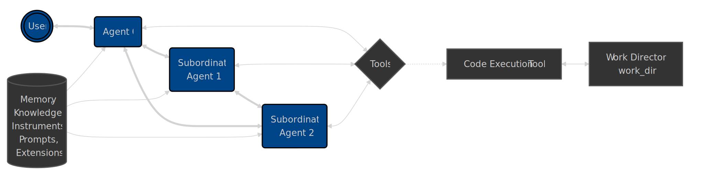

# **Agent Zero: 项目深度解析**

---

### **第一部分：项目愿景与核心理念**

#### **1.1 Agent Zero 是什么？**

Agent Zero 不是一个预设好固定用途的AI助手，而是一个**个人的、有机的、与用户共同成长的智能体框架 (Agentic Framework)**。

可以把它理解为一个拥有基础学习和行动能力的“数字生命体”。它的核心价值不在于开箱即用的特定功能，而在于其无限的**可塑性**和**成长性**。它被设计为一张白纸，用户（它的“导师”）通过不断的交互、指导和扩展，逐步将其塑造成一个专属于自己的、独一-无二的强大助手。

#### **1.2 它解决了什么核心问题？**

当前市场上的AI应用和框架往往存在以下痛点：

*   **黑盒化 (Black Box)**: 用户不清楚其内部决策逻辑，难以信任和定制。
*   **功能固化 (Fixed Functionality)**: 功能由开发者预设，用户难以扩展以适应自己独特的工作流。
*   **缺乏个性 (Lack of Personality)**: 所有的实例都千篇一律，无法真正融入个人的工作习惯和知识体系。

Agent Zero 直面这些问题，其设计哲学旨在解决：

1.  **透明度问题**: 通过完全开放的 Prompt 和代码，Agent Zero 的一切行为和思考过程都是**可见、可理解、可修改**的。
2.  **灵活性问题**: 它不提供大量固化的“工具”，而是给予智能体使用计算机（命令行、文件系统、代码执行）的**基础能力**，让智能体可以自己创造和使用工具。
3.  **成长性问题**: 通过其独特的记忆和扩展机制，Agent Zero 能够记住过去的对话、成功的解决方案、用户的个人偏好，并随着时间的推移**变得越来越懂你、越来越强大**。

#### **1.3 目标用户是谁？**

Agent Zero 主要面向以下用户群体：

*   **开发者与程序员**: 希望构建、定制和实验自己的AI智能体，将其作为开发工作流中的一环。
*   **AI爱好者与高级玩家**: 对AI内部工作原理充满好奇，不满足于使用现成的AI产品，渴望探索AI能力的边界。
*   **希望打造专属AI助手的专业人士**: 例如研究员、分析师、作家等，他们有独特的、重复性的信息处理需求，希望通过训练一个AI助手来自动化他们的工作流。

简而言之，Agent Zero 是为那些**不想只做AI的“使用者”，更想成为AI的“塑造者”**的人准备的。

---

### **第二部分：核心功能与特性详解**

Agent Zero 的独特价值体现在其几大核心设计之上：

#### **2.1 多智能体协作 (Multi-Agent Cooperation)**

Agent Zero 的架构基于一个简单的**层级结构**。每个智能体都可以创建并管理自己的下级智能体，并将复杂的任务分解给它们去完成。

*   **用户即上帝**: 在这个体系中，人类用户扮演的是最顶层（第0层）的“上帝”角色。
*   **任务分解**: 当一个智能体接收到复杂任务时（例如“为我写一个关于微服务架构的博客”），它可以创建一个下级智能体，并赋予其一个更具体的子任务（例如“研究微服务的优缺点并列出大纲”）。
*   **上下文隔离**: 这种模式极大地保持了每个智能体上下文的清洁和专注，避免了单个智能体在处理多阶段复杂任务时“精神错乱”。

#### **2.2 动态工具使用：计算机即工具 (Computer as a Tool)**

与其他框架给智能体提供大量预设的、单一功能的API工具不同，Agent Zero 的理念是“授人以渔”。

*   **基础能力**: 它只为智能体提供最基础但最强大的几种能力：**在线搜索、代码/终端执行、记忆管理和通信**。
*   **按需创造**: 基于这些基础能力，智能体可以根据任务需求，**自行编写和执行代码来创造临时的、一次性的工具**。例如，它可以通过写一个Python脚本来分析CSV文件，而不是依赖一个固定的 `analyze_csv` 工具。
*   **Instruments**: 对于需要复用的功能，用户可以通过“Instruments”机制，将其封装成一个可被智能体随时调用的脚本，而无需将其逻辑硬编码到系统 Prompt 中，极大地节省了 Token。

#### **2.3 可进化的记忆系统 (Evolvable Memory System)**

Agent Zero 的记忆系统是其“成长性”的核心。它不是一个简单的对话历史记录器，而是一个复杂的多层结构。

*   **短期记忆 (对话历史)**: 为了处理长对话，系统会自动对较早的消息进行**摘要压缩**，在保留核心上下文的同时，有效节约了宝贵的 Context Window。
*   **中期记忆 (解决方案)**: 当智能体成功完成一个任务后，它会将这个**解决方案**（包括思考链、使用的代码等）存入一个专门的数据库。在未来遇到相似任务时，它可以直接检索并复用这个成功的经验。
*   **长期记忆 (知识库)**: 用户可以投喂各种文档（PDF, TXT, MD等）到 `knowledge/` 目录中，这些文档会被自动索引，成为智能体可以随时查询的**私有知识库**，实现RAG（检索增强生成）。
*   **行为记忆**: 智能体可以根据用户的指令**动态调整自己的行为**（例如“以后请用英式英语回答”），这些行为准则会被存入一份特殊的 `behaviour.md` 文件中，持久生效。

#### **2.4 完全可定制的行为 (Prompt-Driven Behavior)**

Agent Zero 的“灵魂”完全由 `prompts/` 目录下的 Markdown 文件定义。

*   **一切皆可改**: 从智能体的角色定义、沟通方式、解决问题的策略，到工具的使用说明，所有的一切都以人类可读的文本形式存在，用户可以随意修改。
*   **Profile 机制**: 用户可以创建多个不同的 Prompt Profile（例如，一个用于“创意写作”，一个用于“代码助手”），并在启动时轻松切换，让同一个 Agent Zero 实例扮演完全不同的角色。

#### **2.5 丰富的扩展机制 (Rich Extensibility)**

除了修改 Prompt，Agent Zero 还提供了更深度的代码级扩展方式。

*   **Custom Tools**: 用户可以遵循特定格式，在 `python/tools/` 目录下添加新的 Python 类来实现自定义的永久性工具。
*   **Extensions**: 这是一个更强大的机制。用户可以在 `python/extensions/` 目录下的特定生命周期钩子（如“消息循环开始前”、“系统Prompt生成后”）中放入自己的 Python 脚本，从而在不修改核心代码的情况下，深度改变框架的运行逻辑。

---

### **第三部分：系统架构与工作原理**

#### **3.1 运行时架构：Docker 为核心**

Agent Zero 强烈推荐通过 **Docker** 来运行，这种方式带来了巨大的好处：

*   **环境一致性**: 杜绝了“在我机器上能跑”的问题。无论你的主机是 Windows, macOS 还是 Linux，容器内都拥有一个完全一致的、预配置好的运行环境。
*   **简化部署**: 用户无需在自己的电脑上安装 Python、配置各种依赖库，只需安装 Docker Desktop 即可一键启动。
*   **安全性**: 所有文件操作和代码执行都被隔离在容器内部，不会意外影响到用户的宿主计算机，提供了一个安全的“沙箱”。

#### **3.2 高层系统架构**

下图展示了 Agent Zero 的核心组件及其相互关系：



*   **层级关系**: 用户或顶层智能体 (Agent 0) 位于顶端，可以将任务分解给下级智能体。
*   **共享资产**: 所有智能体共享同一套资产，包括：
    *   **Prompts**: 定义行为和思考模式。
    *   **Memory / Knowledge**: 提供记忆和知识支持。
    *   **Tools / Instruments / Extensions**: 提供行动能力和扩展性。

#### **3.3 核心组件解析**

| 组件 (目录) | 作用与描述 |
| --- | --- |
| **Agents (`agent.py`)** | **核心执行者**。负责接收指令、调用大语言模型进行思考和规划、并决定使用哪个工具来完成任务。 |
| **Tools (`python/tools/`)** | **智能体的“双手”**。提供了具体的能力，如执行代码 (`code_execution_tool`)、与下级沟通 (`call_subordinate`)、保存记忆 (`memory_tool`) 等。 |
| **Prompts (`prompts/`)** | **智能体的“灵魂”**。这是一系列相互关联的Markdown文件，精确定义了智能体在思考和行动时应遵循的规则、格式和指南。 |
| **Memory (`memory/`)** | **智能体的“大脑”**。这是一个持久化存储区域，用于存放对话历史、成功解决方案和用户指令，让智能体能够学习和成长。 |
| **Knowledge (`knowledge/`)** | **智能体的“书库”**。用户可以将自己的文档放入此目录，智能体可以通过RAG技术查询这些私有知识。 |
| **Instruments (`instruments/`)** | **轻量级工具库**。用户可以添加自己的脚本（如 `.sh`, `.py`），智能体可以在需要时通过名称调用它们，这是一种高效的、低Token消耗的扩展方式。 |
| **Extensions (`python/extensions/`)** | **深度定制的“插件”**。允许开发者在框架的特定执行点（生命周期钩子）注入自定义的Python代码，以实现对核心逻辑的修改和增强。 |
| **Web UI (`webui/`)** | **用户交互界面**。提供了一个美观、实时的前端界面，用于与智能体对话、查看其思考过程、管理设置和查看日志。 |

#### **3.4 一个典型的工作流程**

1.  **用户输入**: 用户通过 Web UI 发出指令，例如“帮我写一个关于Docker的介绍”。
2.  **思考与规划**: Agent 0 接收指令，调用大语言模型（LLM）。LLM 根据 `solving.md` 等 prompt 的指示，生成一个思考链（Chain of Thought），决定第一步是使用 `knowledge_tool` 的搜索功能来收集信息。
3.  **工具使用**: Agent 0 执行 `knowledge_tool`。该工具内部调用 SearXNG 搜索引擎，并将搜索结果返回。
4.  **结果处理**: Agent 0 接收到搜索结果，再次调用LLM进行分析和总结，并规划下一步（例如，将总结内容整理成大纲）。
5.  **循环与响应**: 这个“思考 -> 使用工具 -> 处理结果”的循环会一直持续，直到任务完成。最终，Agent 0 会使用 `response` 工具，将整理好的最终答案输出给用户。

---

### **第四部分：快速上手指南**

本指南将帮助你用最快的方式启动并运行 Agent Zero。

#### **4.1 环境要求**

*   一台安装了 **Docker Desktop** 的计算机 (Windows, macOS, or Linux)。这是唯一的要求。

#### **4.2 启动 Agent Zero (Docker 方式)**

打开你的终端或命令行工具，执行以下两行命令：

```bash
# 第一步：从 Docker Hub 拉取最新的 Agent Zero 镜像
docker pull agent0ai/agent-zero

# 第二步：运行镜像，并将容器的80端口映射到你电脑的50001端口
docker run -p 50001:80 agent0ai/agent-zero
```

#### **4.3 开始使用**

1.  **访问 Web UI**: 当你看到终端输出类似 `Uvicorn running on http://0.0.0.0:80` 的信息后，打开你的浏览器，访问 `http://localhost:50001`。
2.  **配置模型**: 首次启动时，你会被引导到设置页面。你需要在这里配置你想要使用的大语言模型（LLM）的提供商和API密钥。默认推荐使用 OpenRouter。
3.  **开始对话**: 配置完成后，返回主聊天界面，你就可以开始向 Agent Zero 发出指令了！

#### **4.4 你的第一次交互**

尝试给它一个简单的任务，来观察它的工作流程：

> "你好，请介绍一下你自己，并告诉我你有哪些基础工具？"

你将在界面上实时看到它的思考过程、它如何查询自己的 prompt 文件、以及它最终生成的回答。欢迎来到 Agent Zero 的世界！

---

### **第五部分：定制与扩展——打造你的专属智能体**

这是 Agent Zero 最令人兴奋的部分。下面将介绍几种从易到难的定制化方法。

#### **5.1 方式一：修改 Prompts (最简单)**

这是改变智能体行为最直接的方式，无需编写任何代码。

1.  **找到 Prompts**: 所有的核心 prompts 都在 `prompts/default/` 目录下。
2.  **创建你的 Profile**:
    *   在 `prompts/` 目录下创建一个新文件夹，例如 `my_agent`。
    *   将 `prompts/default/` 中你想要修改的文件（例如 `agent.system.main.role.md`）复制到 `prompts/my_agent/` 中。
    *   用你自己的话语修改这个文件，赋予它全新的角色、个性和说话风格。
3.  **激活 Profile**: 在 Web UI 的设置页面，将 "Agent Config" -> "Prompts Subdirectory" 的值从 `default` 改为 `my_agent`。
4.  **完成**: 重新开始一个对话，你的智能体就会以全新的面貌出现！Agent Zero 会智能地合并你的自定义 prompt 和默认 prompt，你只需提供你想修改的部分。

#### **5.2 方式二：添加 Instruments (中等)**

当你希望智能体能执行一个特定的、可复用的脚本时（例如，一个调用你公司内部API的脚本），Instruments 是最佳选择。

1.  **创建 Instrument 目录**: 在 `instruments/custom/` 目录下创建一个新文件夹，例如 `my_tool`。
2.  **编写实现脚本**: 在 `instruments/custom/my_tool/` 中创建一个脚本文件，例如 `run.py` 或 `run.sh`。这个脚本应该从命令行接收参数并完成特定任务。
3.  **编写描述文件**: 在同一个目录下，创建一个 `my_tool.md` 文件。在这个文件中，用自然语言向智能体描述这个 Instrument 的功能、它接收什么参数、以及如何使用它。
4.  **完成**: Agent Zero 会自动检测到这个新的 Instrument。当任务相关时，它会通过记忆系统回忆起这个工具，并学习如何通过 `code_execution_tool` 来调用它。

#### **5.3 方式三：添加 Extensions (最灵活)**

这是最强大的定制方式，允许你用 Python 代码直接介入框架的运行流程。

1.  **确定注入点**: 浏览 `python/extensions/` 目录，找到你希望介入的执行阶段。例如，如果你想在每次 LLM 调用前都对 prompt 做一些特殊处理，可以选择 `before_main_llm_call` 目录。
2.  **编写 Python 脚本**: 在选定的目录下创建一个 Python 文件（推荐以数字开头以控制执行顺序，如 `_99_my_logic.py`）。
3.  **编写逻辑**: 在脚本中编写你的 Python 代码。你可以访问和修改传递给该阶段的参数（通常是一个包含各种上下文信息的 `params` 字典）。
4.  **完成**: 你的代码将在框架运行到该生命周期钩子时被自动执行。

通过这三种方式的组合，你可以将 Agent Zero 从一个通用框架，完全转变为一个深度集成在你个人工作流中的、独一无二的强大伙伴。